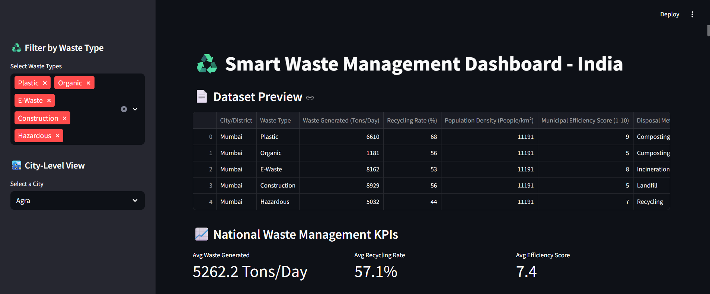
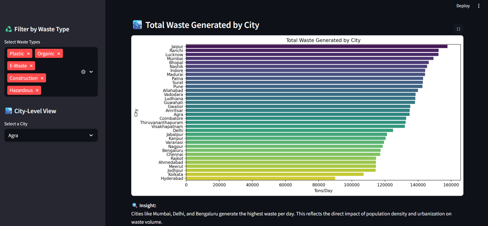
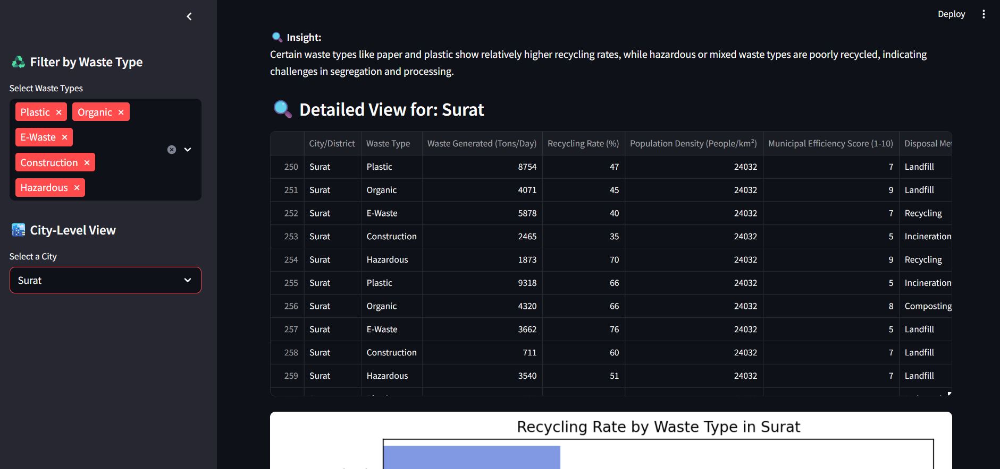
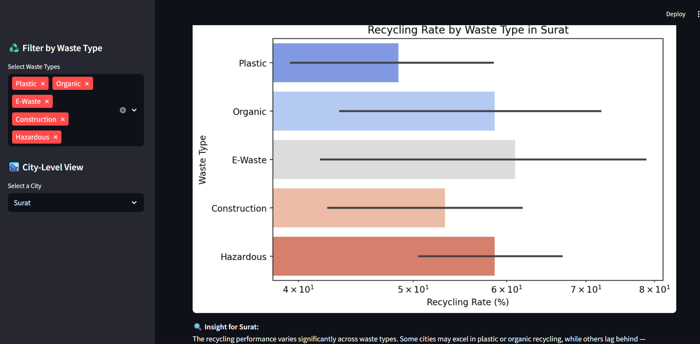
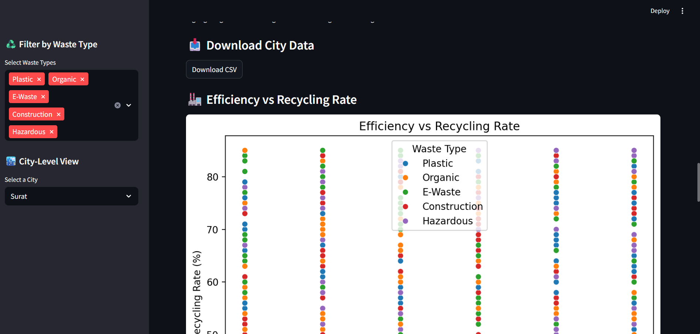
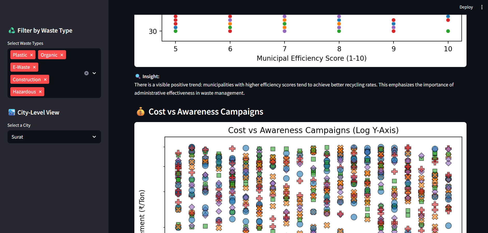
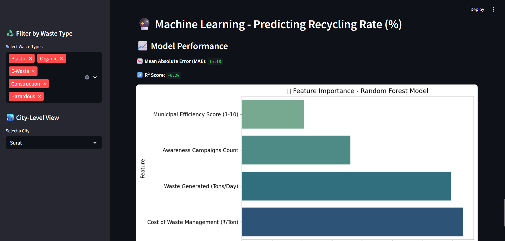
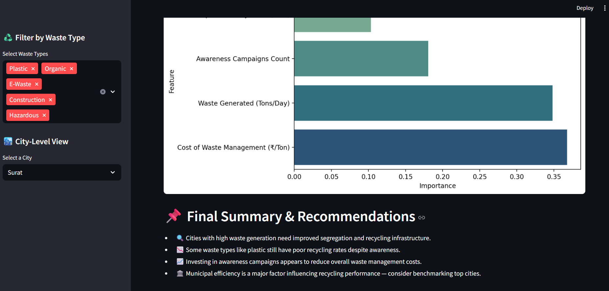

# ♻️ Smart Waste Management Dashboard - India
🟢 [Live Demo](https://waste-management-dashboard-hyfskwffxgxixx7jm7g9xc.streamlit.app/)

An interactive data science dashboard analyzing waste generation, recycling rates, municipal efficiency, and cost factors across Indian cities.

## 📌 Features

- 📊 City-wise waste generation analysis
- ♻️ Waste type-wise recycling rates
- 💰 Cost vs awareness impact visualization
- 🏭 Municipal efficiency vs recycling correlation
- 🏙️ Interactive city-level filters and insights
- ⚙️ Built with Python, Pandas, Seaborn, Streamlit

## 📊 Dataset

- **Source**: [Kaggle - Indian Waste Management Dataset](https://www.kaggle.com/) https://www.kaggle.com/datasets/krishnayadav456wrsty/waste-management-and-recycling-in-indian-cities ("This dataset is used strictly for educational purposes, and full credit goes to the original uploader on Kaggle.")
- **Coverage**: 34 cities across India
- **Includes**:
  - Waste generated (tons/day)
  - Recycling rate (%)
  - Waste type breakdown
  - Awareness campaign count
  - Municipal efficiency scores (1–10)
  - Cost of waste management (₹/Ton)

## 🚀 Run Locally

To run this project on your local machine:

```bash
git clone https:https://github.com/HrishiKShah28/WASTE-MANAGEMENT-DASHBOARD
cd project-name
pip install -r requirements.txt
streamlit run stream.py
## 📸 Demo Preview










